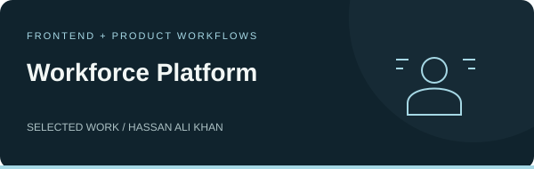
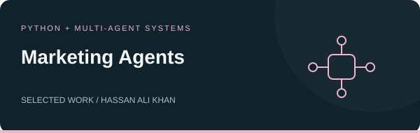

  

  <a href="#about">About</a> &nbsp; / &nbsp;
  <a href="#selected-projects">Projects</a> &nbsp; / &nbsp;
  <a href="#professional-experience">Experience</a> &nbsp; / &nbsp;
  <a href="#technology-stack">Skills</a> &nbsp; / &nbsp;
  <a href="#education-and-recognition">Education</a> &nbsp; / &nbsp;
  <a href="#work-with-me">Contact</a>

  
  &nbsp;
  

## About

I'm **Hassan Ali Khan**, a **Full-Stack Developer & AI Application Engineer** based in Pakistan. At **Tango Sys**, I work across interfaces, backend APIs, databases, and AI integrations to turn business requirements into useful products.

My work spans recruitment, workforce management, education, and agricultural investment. I enjoy connecting clear user experiences with the systems that make them work.

<table>
<tr>
<td width="33%" valign="top"><h3>Web & SaaS</h3>
Business applications, dashboards, multi-tenant platforms, and subscription workflows.
</td>
<td width="33%" valign="top"><h3>Mobile applications</h3>
Cross-platform apps built with React Native and Expo, connected to backend services.
</td>
<td width="33%" valign="top"><h3>Applied AI</h3>
Document processing, RAG, vector search, LLM integrations, and agent workflows.
</td>
</tr>
</table>

**Currently:** Full-Stack Developer at Tango Sys · **Location:** Pakistan · **Languages:** English, Urdu, Pashto

 

## Selected projects

Explore public repositories across full-stack development, mobile applications, automation, and AI.

<table>
<tr>
<td width="50%" valign="top">

<h3>Local services, in your own language.</h3>

A service marketplace prototype with Roman Urdu and English requests, nearby provider matching, and agent-assisted booking workflows. Includes simulated features for demonstrations.

<code>React Native</code> <code>Expo</code> <code>FastAPI</code> <code>Gemini</code>

<a href="https://github.com/devhassanalikhan/gigconnect-pk"><strong>Explore KaamGraph ↗</strong></a>

</td>
<td width="50%" valign="top">

<h3>A clearer working day for every team.</h3>

An attendance and payroll application with GPS-validated check-ins, leave management, employee dashboards, reports, and payslips.

<code>Next.js</code> <code>TypeScript</code> <code>MongoDB</code> <code>Tailwind CSS</code>

<a href="https://github.com/devhassanalikhan/employee-attendance"><strong>Explore AttendEase ↗</strong></a>

</td>
</tr>
<tr>
<td width="50%" valign="top">

<h3>Business listings into organized leads.</h3>

A lead collection toolkit with a React dashboard, Chrome extension, CSV exports, and AI-assisted email drafting.

<code>React</code> <code>Express</code> <code>SQLite</code> <code>Playwright</code> <code>Gemini</code>

<a href="https://github.com/devhassanalikhan/mapleads-studio"><strong>Explore MapLead Studio ↗</strong></a>

</td>
<td width="50%" valign="top">

<h3>Financial data into structured research.</h3>

A multi-agent application combining company financial data and news sentiment into structured research reports.

<code>Python</code> <code>FastAPI</code> <code>LangGraph</code> <code>Streamlit</code>

<a href="https://github.com/devhassanalikhan/Investment-Analyst-Report-Generator"><strong>Explore Investment Analyst ↗</strong></a>

</td>
</tr>
<tr>
<td width="50%" valign="top">

<h3>Interfaces for workforce mobility.</h3>

A React application for workforce mobility, presenting worker profiles, credentials, and international placement workflows.

<code>React</code> <code>TypeScript</code> <code>Vite</code> <code>Tailwind CSS</code>

<a href="https://github.com/devhassanalikhan/Workforce-Platform"><strong>Explore Workforce Platform ↗</strong></a>

</td>
<td width="50%" valign="top">

<h3>Coordinated marketing workflows.</h3>

A Python project exploring coordinated SEO, content, social media, email, and advertising workflows through specialized agents and an orchestration layer.

<code>Python</code> <code>AI agents</code> <code>Workflow automation</code>

<a href="https://github.com/devhassanalikhan/digital-marketing-agent-tool"><strong>Explore Marketing Agents ↗</strong></a>

</td>
</tr>
</table>

<a href="https://github.com/devhassanalikhan?tab=repositories"><strong>Browse all repositories ↗</strong></a>

## Professional experience

### Full Stack Developer · Tango Sys Pvt Ltd
**January 2026 – Present**

Building web and mobile products across recruitment, workforce management, education, and agricultural investment.

| Product | My contribution |
| :--- | :--- |
| **HR Operator** · Recruitment | Multi-tenant ATS with AI resume parsing, candidate matching, vector search, public careers pages, and Stripe subscription billing. |
| **AttendEase** · Workforce management | GPS-validated attendance, leave management, payroll, reports, and payslips. |
| **QLMS** · Education | Mobile and admin applications with recitation grading, offline practice, parent access, and permissions across five roles. Delivered eight client-verified sprints. |
| **Agro World** · Agricultural investment | Mobile application, backend API, database, and marketing website with portfolio and installment tracking. |

<strong>Earlier experience — AI development, web development, and technical support</strong>

 

| Role | Organization & dates | Work |
| :--- | :--- | :--- |
| **IT Support Apprentice** | SNGPL, Islamabad · Nov–Dec 2025 | Automated Oracle/Excel data extraction and approval workflows. |
| **AI Developer Intern** | Kartoa Technologies · Aug–Nov 2025 | Built LLM applications and Python backend workflows with LangChain, LangGraph, and Azure AI; optimized retrieval for enterprise search. |
| **Technical Support · Part-time** | Eagle Hubs · Jul 2024–Sep 2025 | Built a marketplace website and implemented technical SEO improvements, including sitemaps and redirects. |
| **Full Stack Web Developer Intern** | InoTech Solutions · Nov 2023–Apr 2024 | Built a responsive Angular application with Firebase for real-time data synchronization. |

 

## Technology stack

| Area | Technologies |
| :--- | :--- |
| **Frontend** | React · Next.js · TypeScript · JavaScript · Tailwind CSS · shadcn/ui · Angular |
| **Mobile** | React Native · Expo |
| **Backend & APIs** | Python · FastAPI · Pydantic · SQLAlchemy · Node.js · Express · REST APIs |
| **Databases** | PostgreSQL · Supabase · MongoDB · MySQL · SQLite · Firebase |
| **AI & automation** | LangChain · LangGraph · OpenAI · Gemini · RAG · Vector search · AI agents · MCP · Playwright |
| **Identity & payments** | JWT · OAuth2 · Role-based access · Supabase RLS · Stripe |
| **Tools & cloud** | Git · GitHub · GitLab · Docker · Microsoft Azure · Google Cloud · Vercel · Postman |

 

## Education and recognition

<table>
<tr>
<td width="50%" valign="top">
<h3>Education</h3>

<strong>BS Computer Science</strong> National University of Modern Languages (NUML) Islamabad · September 2021 – July 2025

<h3>Certifications</h3>

Azure AI Fundamentals — Microsoft Python Essentials — Cisco

</td>
<td width="50%" valign="top">
<h3>Achievements & leadership</h3>

<strong>2nd Position</strong> NUML Open House — Final Year Project

<strong>President</strong> NUML CSR Society

<strong>CyberSiege CTF</strong> MCS

</td>
</tr>
</table>

 

## Work with me

<table>
<tr>
<td width="50%" valign="top">
<h3>For hiring teams</h3>

I'm open to <strong>Full-Stack Developer</strong> and <strong>AI Application Engineer</strong> roles.

I bring experience across frontend interfaces, backend services, databases, mobile development, and practical AI integrations.

<a href="mailto:dev.hassanalikhan@gmail.com?subject=Full-time%20opportunity"><strong>Discuss a role ↗</strong></a>

</td>
<td width="50%" valign="top">
<h3>For freelance clients</h3>

I can help with:

<ul><li>Web and mobile applications</li><li>SaaS products and MVP development</li><li>RAG chatbots and AI integrations</li><li>Backend APIs and workflow automation</li></ul>

<a href="mailto:dev.hassanalikhan@gmail.com?subject=Freelance%20project"><strong>Discuss a project ↗</strong></a>

</td>
</tr>
</table>

  <strong>Have a role or project in mind?</strong>  
  <a href="mailto:dev.hassanalikhan@gmail.com">dev.hassanalikhan@gmail.com</a>
  &nbsp; · &nbsp;
  <a href="https://www.linkedin.com/in/devhassanalikhan/">LinkedIn</a>
  &nbsp; · &nbsp;
  <a href="https://github.com/devhassanalikhan?tab=repositories">GitHub repositories</a>

---

Hassan Ali Khan · Full-stack development & applied AI · Pakistan

