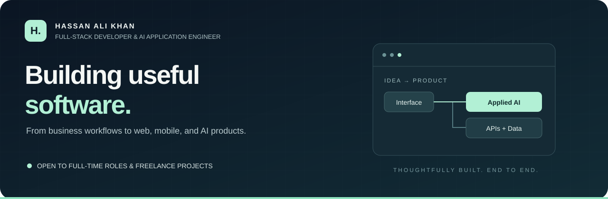
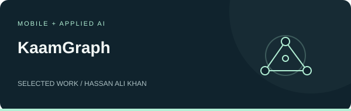
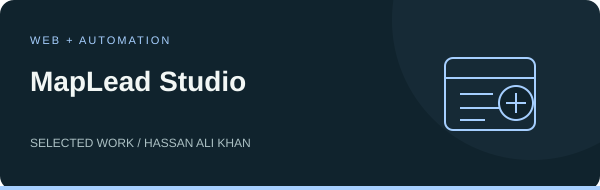
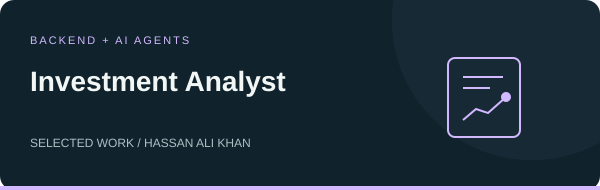

  

  <a href="https://www.linkedin.com/in/devhassanalikhan/"><strong>LinkedIn</strong></a>
  &nbsp; · &nbsp;
  <a href="mailto:dev.hassanalikhan@gmail.com"><strong>Let's work together</strong></a>
  &nbsp; · &nbsp;
  <a href="https://github.com/devhassanalikhan?tab=repositories"><strong>Explore my code ↗</strong></a>

 

## Software that connects ideas to everyday work.

I'm **Hassan**, a Full-Stack Developer at **Tango Sys**, based in Pakistan. I build web and mobile products and integrate AI where it helps people get things done—from recruitment and education to business automation.

**BS Computer Science · NUML, Islamabad**  
**Available for full-time opportunities and freelance projects.**

 

## Selected projects

A selection of public repositories across mobile development, automation, and applied AI.

<table>
<tr>
<td width="50%" valign="top">

<h3>Local services, in your own language.</h3>

A service marketplace prototype with Roman Urdu and English requests, nearby provider matching, and agent-assisted booking workflows. Includes simulated features for demonstrations.

<code>React Native</code> <code>Expo</code> <code>FastAPI</code> <code>Gemini</code>

<a href="https://github.com/devhassanalikhan/gigconnect-pk"><strong>Explore repository ↗</strong></a>

</td>
<td width="50%" valign="top">

<h3>From business listings to organized leads.</h3>

A lead collection toolkit with a React dashboard, Chrome extension, CSV exports, and AI-assisted email drafting.

<code>React</code> <code>Express</code> <code>SQLite</code> <code>Playwright</code> <code>Gemini</code>

<a href="https://github.com/devhassanalikhan/mapleads-studio"><strong>Explore repository ↗</strong></a>

</td>
</tr>
<tr>
<td width="50%" valign="top">

<h3>Financial data into structured research.</h3>

A multi-agent application combining company financial data and news sentiment into structured research reports.

<code>Python</code> <code>FastAPI</code> <code>LangGraph</code> <code>Streamlit</code>

<a href="https://github.com/devhassanalikhan/Investment-Analyst-Report-Generator"><strong>Explore repository ↗</strong></a>

</td>
<td width="50%" valign="top">
<h3>Have something in mind?</h3>

I work across the product—from interfaces and APIs to databases and AI integrations.

<strong>For teams</strong> Full-stack development and AI application engineering.

<strong>For clients</strong> MVPs, web and mobile apps, AI features, and workflow automation.

<a href="mailto:dev.hassanalikhan@gmail.com"><strong>Tell me about your project ↗</strong></a>

<a href="https://www.linkedin.com/in/devhassanalikhan/">Connect on LinkedIn</a>

</td>
</tr>
</table>

 

## Built at Tango Sys

| Product | My work |
| :--- | :--- |
| **HR Operator** · Recruitment | Multi-tenant ATS, AI resume parsing, candidate matching, vector search, public careers pages, and Stripe billing. |
| **AttendEase** · Workforce management | GPS-validated attendance, leave management, payroll, reports, and payslips. |
| **QLMS** · Education | Mobile and admin apps, recitation grading, offline practice, parent access, and permissions across five roles. |
| **Agro World** · Agricultural investment | Mobile app, backend API, and website with portfolio and installment tracking. |

 

## My toolkit

| Build the experience | Connect the system | Add intelligence |
| :--- | :--- | :--- |
| React · Next.js | Python · FastAPI | LangChain · LangGraph |
| TypeScript · JavaScript | Node.js · Express | OpenAI · Gemini |
| React Native · Expo | PostgreSQL · Supabase | RAG · Vector search |
| Tailwind CSS · Angular | MongoDB · SQLite · Firebase | LLM integrations · Agent workflows |

**Tools & cloud:** Git · GitHub · Docker · Microsoft Azure · Google Cloud · Vercel

 

---

  <strong>Let's build something useful.</strong>  
  Open to full-time roles and freelance collaborations.  
  <a href="mailto:dev.hassanalikhan@gmail.com">dev.hassanalikhan@gmail.com</a>
  &nbsp; · &nbsp;
  <a href="https://www.linkedin.com/in/devhassanalikhan/">LinkedIn ↗</a>

